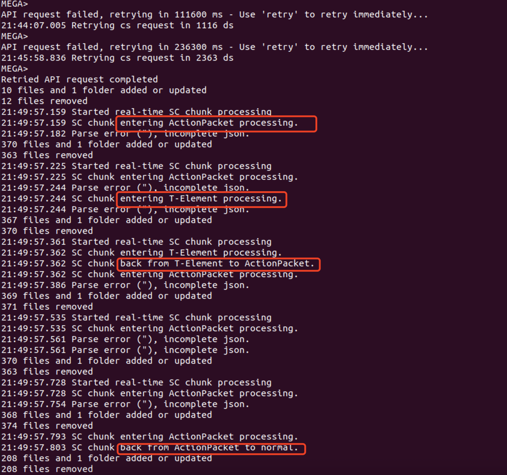

# MEGA SDK Chunked Processing Mechanism

## Overview

When `pendingsc->mChunked` is set to `true`, the MEGA SDK can process actionpackets data received from the server in real-time without waiting for the complete response to arrive. This significantly improves response times when handling large datasets.

## Mechanism Activation

### 1. Automatic Enablement
```cpp
// In megaclient.cpp:3346
pendingsc->mChunked = !isClientType(ClientType::VPN);
```
- Chunked processing is enabled by default for non-VPN clients
- VPN clients are excluded due to their minimal data requirements

### 2. Data Reception Conditions
- Server returns long responses (e.g., large amounts of actionpackets from fetchnodes)
- Network data arrives in chunks rather than as a complete response
- `pendingsc->bufpos > pendingsc->notifiedbufpos` (new unprocessed data available)

## Data Flow

### 1. Network Layer Data Reception
```cpp
// posix/net.cpp:1995
size_t CurlHttpIO::write_data(void* ptr, size_t size, size_t nmemb, void* target)
{
    HttpReq *req = (HttpReq*)target;
    // ... 
    if (len)
    {
        req->put(ptr, static_cast<unsigned>(len), true);  // 👈 Key: Data written to buffer
    }
    // ...
}
```

### 2. Data Appended to Buffer
```cpp
// http.cpp:405
void HttpReq::put(void* data, unsigned len, bool purge)
{
    // ...
    in.append((char*)data, len);  // Data appended to in string
    bufpos += len;                // Update current data position
}
```

### 3. Main Loop Detects New Data
```cpp
// megaclient.cpp:3223 in exec() function
case REQ_INFLIGHT:
    if (pendingsc->contentlength > 0 && pendingsc->bufpos > pendingsc->notifiedbufpos)
    {
        if (pendingsc->mChunked)  // 👈 Check if chunked enabled
        {
            size_t availableBytes = pendingsc->bufpos - pendingsc->notifiedbufpos;
            LOG_info << "Processing SC chunk: contentlength=" << pendingsc->contentlength
                    << ", bufpos=" << pendingsc->bufpos
                    << ", notifiedbufpos=" << pendingsc->notifiedbufpos
                    << ", availableBytes=" << availableBytes;
            if (availableBytes > 0)
            {
                // Call chunked processing
                int bytes = procscchunk();  // 👈 Key: Real-time data processing
                if (bytes > 0)
                {
                    pendingsc->purge(bytes);  // Release processed data
                }
            }
            pendingsc->notifiedbufpos = pendingsc->bufpos;
        }
    }
```

### 4. Chunked Processing Logic
```cpp
// megaclient.cpp:5569
int MegaClient::procscchunk()
{
    // State machine handles different types of data
    switch (mScChunkedStatus)
    {
        case ScChunkedStatus::NotStarted:
            // Initialize, check data format
            break;
            
        case ScChunkedStatus::ProcessingAction:
            // Process regular actionpackets
            LOG_warn << "SC chunk entering ActionPacket processing.";
            while (jsonsc.enterobject() && jsonsc.storeobject())
            {
                processActionPacket(packetStart);  // 👈 Process individual actionpacket
            }
            LOG_warn << "SC chunk back from ActionPacket to normal.";
            break;
            
        case ScChunkedStatus::ProcessingTElement:
            // Process "t" type large node listings
            LOG_warn << "SC chunk entering T-Element processing.";
            while (jsonsc.enterobject() && jsonsc.storeobject())
            {
                processTElement(elementStart);  // 👈 Process individual node element
            }
            LOG_warn << "SC chunk back from T-Element to ActionPacket.";
            break;
    }
}
```

## Testing with megacli Tool

### 1. Prepare Test Environment
```bash
# Build megacli tool
cd mega/mega-sdk
make megacli

# Prepare test directory
mkdir -p /tmp/megatest
```

### 2. Generate High Load Scenario
The key to triggering chunked processing is to create a scenario where multiple server request timeouts accumulate actionpackets, causing server responses to be delivered in chunks.

```bash
# Start multiple megacli instances simultaneously to create high server load
# This will cause request timeouts and actionpacket accumulation

# Terminal 1:
./examples/megacli/megacli
login your@email.com yourpassword
cycleuploaddownload -filecount 1000 -filesize 1 -nameprefix cyc1 /tmp/megatest test

# Terminal 2:
./examples/megacli/megacli  
login your@email.com yourpassword
cycleuploaddownload -filecount 1000 -filesize 1 -nameprefix cyc2 /tmp/megatest test

# Terminal 3:
./examples/megacli/megacli
login your@email.com yourpassword
cycleuploaddownload -filecount 1000 -filesize 1 -nameprefix cyc3 /tmp/megatest test

# Terminal 4:
./examples/megacli/megacli
login your@email.com yourpassword
cycleuploaddownload -filecount 1000 -filesize 1 -nameprefix cyc4 /tmp/megatest test
```

### 3. Enable Debug Logging
```bash
# Set environment variables for detailed logging
export MEGA_DEBUG=1
export MEGA_LOG_LEVEL=verbose

# Or use debug command in megacli:
debug -on -file <your_file_path>

```

### 4. Monitor Key Log Messages
Watch for the following log patterns that indicate chunked processing is active:

```
Processing SC chunk: contentlength=X, bufpos=Y, notifiedbufpos=Z, availableBytes=W
Started real-time SC chunk processing
SC chunk entering ActionPacket processing.
SC chunk back from ActionPacket to normal.
SC chunk entering T-Element processing.
SC chunk back from T-Element to ActionPacket.
```

### 5. Understanding the Test Command
```bash
cycleuploaddownload -filecount 1000 -filesize 1 -nameprefix cyc3 /tmp/megatest test
```

- `-filecount 1000`: Creates 1000 files for upload/download operations
- `-filesize 1`: Each file is 1 byte (minimal size for maximum operation count)
- `-nameprefix cyc3`: Files will be named cyc3_001, cyc3_002, etc.
- `/tmp/megatest`: Local directory for temporary files
- `test`: Remote folder name in MEGA account

### 6. Expected Behavior During High Load
When multiple instances run simultaneously:

1. **Server Load Increase**: Multiple concurrent operations stress the server
2. **Request Timeouts**: Some requests may timeout due to server load
3. **Actionpacket Accumulation**: Timeouts cause actionpackets to accumulate on server
4. **Chunked Delivery**: When the server finally responds, it delivers accumulated actionpackets in chunks
5. **Real-time Processing**: The SDK processes these chunks as they arrive, rather than waiting for complete response

## Verification Methods

### 1. Visual Example
The following diagram illustrates the incremental processing behavior:



This image shows how data is processed incrementally as it arrives, rather than waiting for the complete response.

### 2. Log Pattern Analysis
Look for sequences like:
```
[DEBUG] Processing SC chunk: availableBytes=256
[WARN] SC chunk entering ActionPacket processing.
[WARN] SC chunk entering T-Element processing.
[WARN] SC chunk back from T-Element to ActionPacket.
[WARN] SC chunk back from ActionPacket to normal.
```

### 3. Network Activity Monitoring
```cpp
class TestApp : public MegaApp
{
    void notify_network_activity(NetworkActivityChannel channel, 
                                NetworkActivityType type, 
                                Error error) override
    {
        if (channel == NetworkActivityChannel::SC)
        {
            switch (type)
            {
                case NetworkActivityType::REQUEST_SENT:
                    cout << "SC request sent" << endl;
                    break;
                case NetworkActivityType::REQUEST_RECEIVED:
                    cout << "SC chunk processed in real-time!" << endl;  // 👈 Called multiple times
                    break;
            }
        }
    }
};
```

### 4. Performance Metrics
- **With Chunked Processing**: Data processed as it arrives, responsive UI
- **Without Chunked Processing**: Delays until complete response received

## Debugging Tips

### 1. Force Enable Chunked Processing
```cpp
if (pendingsc)
{
    pendingsc->mChunked = true;  // Force enable for testing
}
```

### 2. Add Custom Logging
```cpp
// Add in megaclient.cpp procscchunk() function
LOG_info << "Chunked processing status: " << (int)mScChunkedStatus 
         << ", available bytes: " << (pendingsc->bufpos - pendingsc->notifiedbufpos);
```

### 3. Monitor State Changes
```cpp
// Track when chunked status changes
if (previousStatus != mScChunkedStatus)
{
    LOG_warn << "Chunked status changed from " << (int)previousStatus 
             << " to " << (int)mScChunkedStatus;
    previousStatus = mScChunkedStatus;
}
```

## Common Issues and Solutions

### Q: Why isn't chunked processing triggered?
A: Check:
1. `pendingsc->mChunked` is true
2. Network data is actually arriving in chunks (not all at once)
3. Data volume is sufficient (small responses may arrive complete)
4. Multiple concurrent operations are creating server load

### Q: How to verify chunked processing is actually working?
A: Monitor:
1. "SC chunk entering/back from" log messages appear multiple times
2. `notify_network_activity` with `REQUEST_RECEIVED` called multiple times per response
3. `bufpos` and `notifiedbufpos` values change incrementally

### Q: Which operations benefit from chunked processing?
A: Primarily:
1. `fetchnodes()` - Large initial actionpacket loads
2. Long-running server-client connections during high activity
3. Large folder synchronization operations
4. Bulk file operations with many actionpackets

---

The chunked processing mechanism allows MEGA SDK to maintain responsiveness even when handling large server responses by processing data incrementally as it arrives, rather than waiting for complete transmission.

## 概述

当 `pendingsc->mChunked` 设置为 `true` 时，MEGA SDK 能够实时处理从服务器接收的 actionpackets 数据，而不需要等待完整响应接收完毕。这大大提高了大型数据集的处理响应速度。

## 触发条件

### 1. 自动启用条件
```cpp
// 在 megaclient.cpp:3346
pendingsc->mChunked = !isClientType(ClientType::VPN);
```
- 对于非 VPN 客户端，chunked 处理默认启用
- VPN 客户端由于数据量小，不需要 chunked 处理

### 2. 数据接收条件
- 服务器返回长响应（如 fetchnodes 的大量 actionpackets）
- 网络数据分批到达，而不是一次性接收完整响应
- `pendingsc->bufpos > pendingsc->notifiedbufpos`（有新数据未处理）

## 数据流程

### 1. 网络层数据接收
```cpp
// posix/net.cpp:1995
size_t CurlHttpIO::write_data(void* ptr, size_t size, size_t nmemb, void* target)
{
    HttpReq *req = (HttpReq*)target;
    // ... 
    if (len)
    {
        req->put(ptr, static_cast<unsigned>(len), true);  // 👈 关键：数据写入缓冲区
    }
    // ...
}
```

### 2. 数据追加到缓冲区
```cpp
// http.cpp:405
void HttpReq::put(void* data, unsigned len, bool purge)
{
    // ...
    in.append((char*)data, len);  // 数据追加到 in 字符串
    bufpos += len;                // 更新当前数据位置
}
```

### 3. 主循环检测新数据
```cpp
// megaclient.cpp:3223 在 exec() 函数中
case REQ_INFLIGHT:
    if (pendingsc->contentlength > 0 && pendingsc->bufpos > pendingsc->notifiedbufpos)
    {
        if (pendingsc->mChunked)  // 👈 检查是否启用 chunked
        {
            // 有新数据且启用了 chunked 处理
            size_t availableBytes = pendingsc->bufpos - pendingsc->notifiedbufpos;
            if (availableBytes > 0)
            {
                // 调用 chunked 处理
                int bytes = procscchunk();  // 👈 关键：实时处理数据
                if (bytes > 0)
                {
                    pendingsc->purge(bytes);  // 释放已处理的数据
                    // 通知应用层
                    app->notify_network_activity(NetworkActivityChannel::SC,
                                               NetworkActivityType::REQUEST_RECEIVED,
                                               API_OK);
                }
            }
            pendingsc->notifiedbufpos = pendingsc->bufpos;
        }
    }
```

### 4. 分块处理逻辑
```cpp
// megaclient.cpp:5568
int MegaClient::procscchunk()
{
    // 状态机处理不同类型的数据
    switch (mScChunkedStatus)
    {
        case ScChunkedStatus::NotStarted:
            // 初始化，检查数据格式
            break;
            
        case ScChunkedStatus::ProcessingAction:
            // 处理普通 actionpackets
            while (jsonsc.enterobject() && jsonsc.storeobject())
            {
                processActionPacket(packetStart);  // 👈 处理单个 actionpacket
            }
            break;
            
        case ScChunkedStatus::ProcessingTElement:
            // 处理 "t" 类型的大型节点列表
            while (jsonsc.enterobject() && jsonsc.storeobject())
            {
                processTElement(elementStart);  // 👈 处理单个节点元素
            }
            break;
    }
}
```

## 实际测试方法

### 1. 代码验证
```cpp
#include "chunked_test_helper.h"

// 在您的应用中
MegaClient* client = new MegaClient(app, waiter, httpio, dbaccess, gfx, key, userAgent);

// 检查 chunked 状态
ChunkedTestHelper::checkChunkedStatus(client);

// 验证是否正常工作
bool isWorking = ChunkedTestHelper::verifyChunkedProcessing(client);
```

### 2. 日志监控
在启用调试日志后，查找以下关键消息：
```
"Processing SC chunk of X bytes"           // 表示 chunked 处理生效
"Started real-time SC JSON processing"     // 开始实时处理
"Successfully processed action packet"     // actionpacket 处理成功
"Successfully processed t element"         // t 元素处理成功
```

### 3. 网络活动监控
```cpp
class TestApp : public MegaApp
{
    void notify_network_activity(NetworkActivityChannel channel, 
                                NetworkActivityType type, 
                                Error error) override
    {
        if (channel == NetworkActivityChannel::SC)
        {
            switch (type)
            {
                case NetworkActivityType::REQUEST_SENT:
                    cout << "SC request sent" << endl;
                    break;
                case NetworkActivityType::REQUEST_RECEIVED:
                    cout << "SC chunk processed in real-time!" << endl;  // 👈 这个会被多次调用
                    break;
            }
        }
    }
};
```

### 4. 实际场景测试
```cpp
// 1. 大型账户 fetchnodes
client->fetchnodes();  // 会产生大量 actionpackets

// 2. 慢速网络环境
// 使用网络限速工具或在慢速连接下测试

// 3. 监控变量变化
// 在调试器中观察：
// - pendingsc->bufpos 增长
// - pendingsc->notifiedbufpos 跟随更新  
// - mScChunkedStatus 状态变化
// - jsonsc.pos 位置移动
```

## 性能对比

### 启用 Chunked 处理
- ✅ 数据边接收边处理
- ✅ 响应更快，用户体验更好
- ✅ 内存使用更高效（处理后释放）
- ✅ 支持大型数据集

### 禁用 Chunked 处理  
- ❌ 等待完整响应后一次性处理
- ❌ 大型响应延迟高
- ❌ 内存峰值使用量大
- ❌ 可能出现超时问题

## 调试技巧

### 1. 强制启用 chunked
```cpp
if (pendingsc)
{
    pendingsc->mChunked = true;  // 强制启用
}
```

### 2. 模拟数据分块
```cpp
// 使用 ChunkedTestHelper 模拟分块数据接收
std::string testData = ChunkedTestHelper::generateTestActionPackets();
ChunkedTestHelper::simulateChunkedData(client, testData);
```

### 3. 状态检查点
```cpp
// 在关键位置添加检查
ChunkedTestHelper::checkChunkedStatus(client);
ChunkedTestHelper::dumpJsonState(client);
```

## 常见问题

### Q: 为什么我的 chunked 处理没有被触发？
A: 检查：
1. `pendingsc->mChunked` 是否为 true
2. 是否有实际的网络数据分批到达
3. 数据量是否足够大（小响应可能一次性接收完）

### Q: 如何验证 chunked 处理确实在工作？
A: 监控：
1. `notify_network_activity` 被多次调用
2. 日志中出现 "Processing SC chunk" 消息
3. `bufpos` 和 `notifiedbufpos` 的变化

### Q: chunked 处理对哪些操作生效？
A: 主要对以下操作生效：
1. `fetchnodes()` - 大量初始 actionpackets
2. 长时间运行的 server-client 连接
3. 大型文件夹的同步操作

---

通过以上机制，MEGA SDK 能够在接收大型服务器响应时提供更好的实时性和用户体验。
